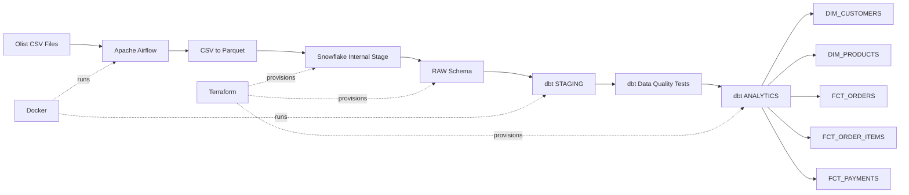

# Olist End-to-End Data Engineering Pipeline

An end-to-end data engineering project built using the Brazilian Olist e-commerce dataset.

## Use Case Objective

Build an end-to-end batch data engineering pipeline for the Olist e-commerce dataset using:

- Airflow for orchestration
- Python/Pandas for ingestion and Parquet conversion
- Snowflake for cloud data warehousing
- dbt for transformation and data quality
- Terraform for Snowflake infrastructure provisioning
- Docker for the local execution environment

## Use Case Flow

```text
Olist CSV
   ↓
Airflow dataset discovery
   ↓
CSV → Parquet
   ↓
Snowflake Internal Stage
   ↓
RAW tables
   ↓
dbt STAGING models
   ↓
dbt data-quality tests
   ↓
ANALYTICS fact/dimension tables

## Architecture



## Tech Stack

- Apache Airflow 3.3.1
- DAG Factory
- Docker
- Python
- Pandas
- PyArrow
- Snowflake
- dbt Core
- dbt-snowflake
- Terraform
- Git

## Pipeline

### 1. Dataset Discovery

Airflow dynamically discovers datasets from the landing directory.

### 2. CSV → Parquet

CSV datasets are converted to Parquet using Pandas and PyArrow.

### 3. Snowflake Stage

Parquet files are uploaded to an internal Snowflake stage.

### 4. RAW Layer

Snowflake tables are inferred and populated from the Parquet files.

### 5. STAGING Layer

dbt cleans and standardizes RAW data.

### 6. Data Quality

dbt tests validate keys, nullability, uniqueness, and relationships.

### 7. ANALYTICS Layer

dbt builds dimensional and fact tables for analytics.

## Analytics Models

### Dimensions

- `DIM_CUSTOMERS`
- `DIM_PRODUCTS`

### Facts

- `FCT_ORDERS`
- `FCT_ORDER_ITEMS`
- `FCT_PAYMENTS`

## Orchestration

The Airflow DAG executes the complete workflow:

```text
discover_datasets
        ↓
csv_to_parquet
        ↓
upload_parquet_to_stage
        ↓
create_raw_table
        ↓
copy_parquet_to_raw
        ↓
validate_raw_load
        ↓
dbt_run_staging
        ↓
dbt_test_staging
        ↓
dbt_run_marts
        ↓
dbt_test_marts
```

## Data Layers

```text
Olist CSV
   ↓
Parquet
   ↓
Snowflake RAW
   ↓
dbt STAGING
   ↓
dbt Tests
   ↓
Snowflake ANALYTICS
```

## Security

Snowflake authentication uses RSA key-pair authentication.

Sensitive files are excluded from Git, including:

- `.env`
- RSA private keys
- `terraform.tfvars`
- Terraform state files
- `dbt/profiles.yml`
- local dbt user configuration

## Project Structure

```text
olist-airflow-project/
├── dags/
│   ├── olist_dag_factory.py
│   ├── olist_ingestion.yml
│   └── olist_tasks.py
│
├── dbt/
│   ├── macros/
│   ├── models/
│   │   ├── staging/
│   │   └── marts/
│   └── dbt_project.yml
│
├── terraform/
│   ├── database.tf
│   ├── warehouse.tf
│   ├── schemas.tf
│   ├── stage.tf
│   ├── file_format.tf
│   ├── provider.tf
│   └── variables.tf
│
├── Dockerfile
├── docker-compose.yaml
├── requirements.txt
├── .gitignore
└── README.md
```

## Status

End-to-end pipeline successfully validated:

```text
Airflow orchestration     ✅
CSV → Parquet             ✅
Snowflake RAW ingestion   ✅
dbt STAGING               ✅
dbt staging tests         ✅
dbt ANALYTICS             ✅
dbt mart tests            ✅
```